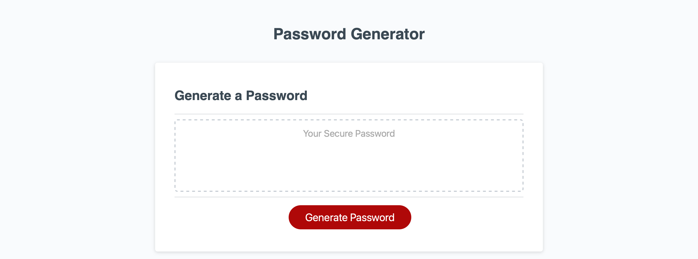

# secure-password-generator

## Description
The purpose of this project was to create an application that can be used to generate a secure random password based on custom criteria. Doing this required conditional logic to include custom criteria, manipulation of arrays, writing a string to an element,and an understanding of event listeners.

## Installation

N/A

## Deployed Webpage

Deployed URL: https://koreycollazo.github.io/secure-password-generator/

## Credits

N/A

## License

N/A
